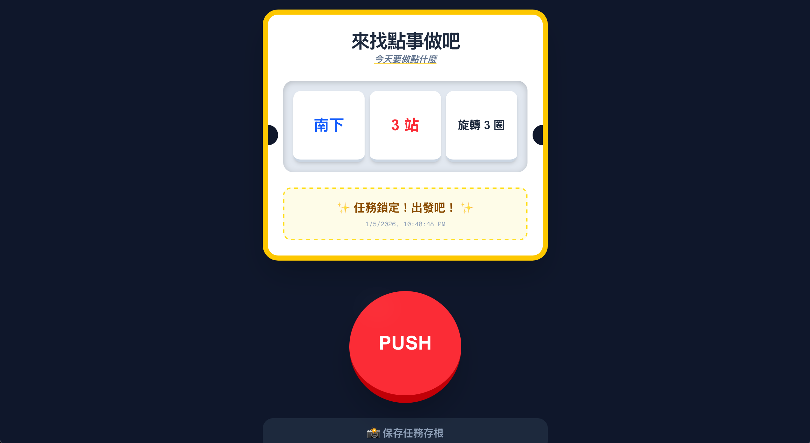

# 🚀 今天要做點什麼 (Let's GO!)

這是一個基於 **Next.js 16** 開發的互動式「來找點事做吧」拍拍機。旨在解決「今天不知道要去哪裡」或「不知道要做什麼」的日常難題，透過趣味的互動方式生成冒險指令。

[👉 立即體驗 Demo](https://liuliuod.github.io/Let-s-GO/)


## ✨ 特色功能

- **3D 互動感按鈕**：擬真的 PUSH 大按鈕，具備物理位移視覺回饋。
- **手動控制停止**：自由決定何時停止轉盤，命運掌握在自己手中。
- **動態內容管理**：任務、方向與站數完全資料化，易於擴充。
- **一鍵保存任務**：支援將生成的任務指令書直接下載為 PNG 圖片。
- **自動化部署**：整合 GitHub Actions，推送程式碼後自動發布至 GitHub Pages。

## 🛠️ 技術棧

- **框架**: [Next.js](https://nextjs.org/) (App Router)
- **樣式**: [Tailwind CSS](https://tailwindcss.com/)
- **動畫與特效**: [canvas-confetti](https://www.npmjs.com/package/canvas-confetti)
- **圖片生成**: [html-to-image](https://www.npmjs.com/package/html-to-image)
- **語言**: [TypeScript](https://www.typescriptlang.org/)

## 📂 專案結構與自定義

專案採用「資料與邏輯分離」的設計，你可以輕鬆修改任務內容：

- `app/constants.ts`: **核心設定檔**。在此修改 `SLOT_CONFIG` 即可增加或減少轉盤格數與內容，修改 `UI_TEXT` 則可調整介面文字。
- `app/page.tsx`: 主要邏輯與 UI 渲染。

## 🚀 本地開發

1. **複製專案**:

   ```bash
   git clone https://github.com/liuliuod/Let-s-GO.git
   ```

2. **安裝依賴**:

    ```bash
    npm install
    ```

3. **啟動開發伺服器**:

    ```bash
    npm run dev-static
    ```

4. **開啟瀏覽器**: [訪問](http://localhost:3000/Let-s-GO)
